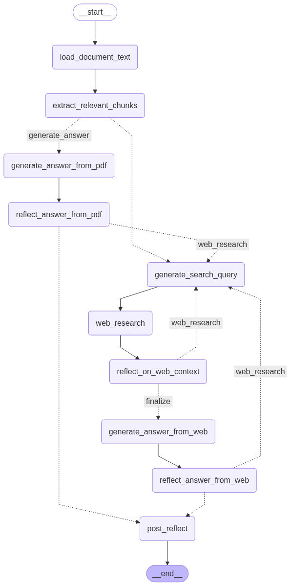

# 🧠 ThinkFusionAgent
A modular research agent that fuses **PDF content** and **live web search** using **LangGraph**, **LLMs**, and **reflection-based reasoning**.

ThinkFusionAgent reads your documents, searches the web, reasons step by step, and refines its answer until it converges on a confident response.

🎥 [Watch Demo Video](./assets/demo.webm)


## 🚀 Features

- 🔍 **Ask anything** — research questions with or without a PDF
- 📄 **PDF + Web hybrid reasoning** using semantic chunking and LLM synthesis
- 🔁 **Reflective improvement loop** (answer → check → revise)
- 📜 **Step-by-step LangGraph tracing** with optional Streamlit UI
- 🌐 Works with **DuckDuckGo, Perplexity, Tavily, or SearxNG**
- 🧠 Fully local-first with **Ollama** or **LMStudio** LLMs
- 🧪 Transparent, testable, extensible


## Pipeline Overview

<div align="center">
  
</div>


## 🚀 Quickstart

```bash
git clone https://github.com/m3hrdadfi/think-fusion-agent.git
cd think-fusion-agent
uv sync
cp .env.example .env  # fill in your keys if needed
PYTHONPATH=src streamlit run app.py
```

Then open: [http://localhost:8501](http://localhost:8501)

You can override these at runtime via the Streamlit sidebar.

```env
LLM_PROVIDER=ollama
LOCAL_LLM=llama3.2:3b
LOCAL_EM=nomic-embed-text:v1.5

SEARCH_API=duckduckgo
OLLAMA_BASE_URL=http://localhost:11434
LMSTUDIO_BASE_URL=http://localhost:1234/v1

TAVILY_API_KEY=your-tavily-key
PERPLEXITY_API_KEY=your-pplx-key
SEARXNG_URL=http://localhost:8888

MAX_WEB_RESEARCH_ATTEMPTS=4
FETCH_FULL_PAGE=True
STRIP_THINKING_TOKENS=True
```

## Ethical Use & Disclaimer
This project uses **LLMs**. That means:

* The agent may generate **incorrect, biased, or misleading output**
* It may hallucinate facts not in the document or search results
* Some search content may be out of date or incomplete
* Your input and system prompts influence behavior — review output critically

> ⚠️ **ThinkFusionAgent is a tool, not an oracle.** Use judgment and verify results when working with important or sensitive topics.


## Contributing

PRs welcome! To contribute:

1. Fork and clone this repo
2. Set up `.env` and install dependencies
4. Submit a clear, focused pull request

## License
[MIT License](LICENSE)


## 🙏 Inspiration

ThinkFusionAgent was inspired by the excellent [LocalDeepResearch](https://github.com/langchain-ai/local-deep-researcher) project by the LangChain team.
While the architecture and implementation differ, the core ideas of **document-grounded reasoning**, **modular LangGraph workflows**, and **reflection-based refinement** shaped the initial direction of this project.
Thanks to the open-source community for sharing these foundations. 
Built for the joy of experimenting with AI-assisted development and pushing boundaries.
